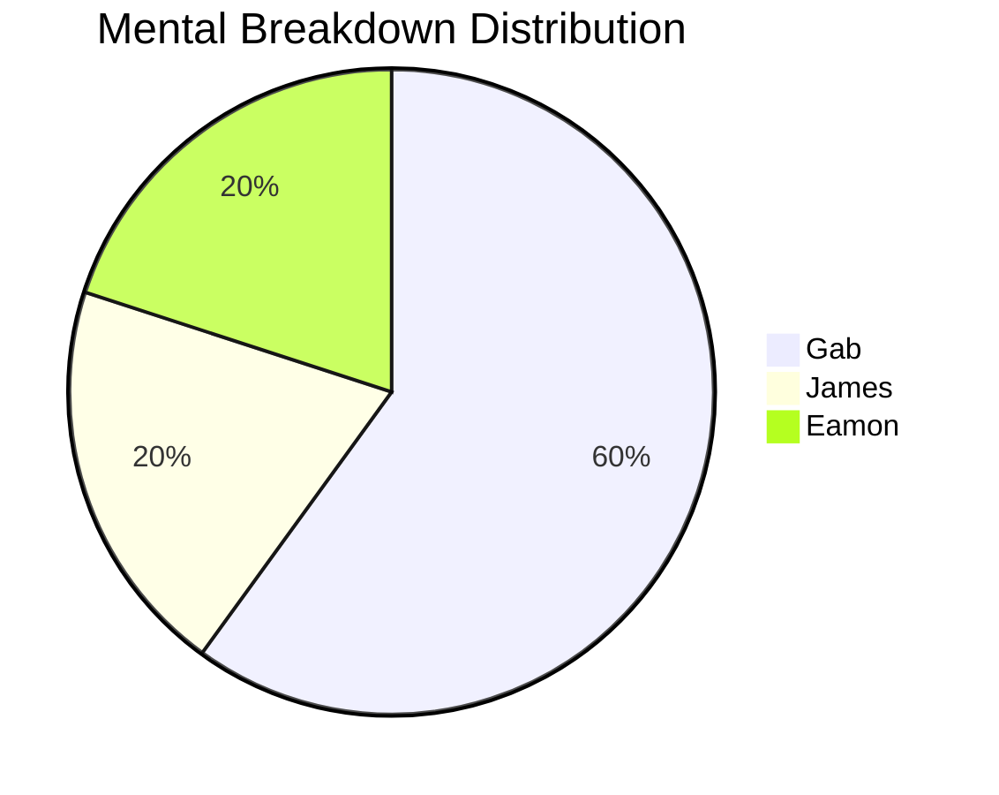

# tasktree
Created by
- Gabriel - Developer
- James - Prototyper
- Eamon - Designer & Developer
## Abstract
A failed experiment that was the product of around 8 hours of work and 4 separate mental breakdowns spread among our members. 
Designed to be a project management system meant to break down complex, massive tasks into smaller, more manageable ones. 
This repository contains both the "final" design (very broken, very unfinished) and the text engine demo (early prototype) created because TypeScript hates me too much.
## Technologies
- React.js
- > ReactFlow
- TypeScript
- Vite
- Python (Text Engine Demo)

**NONE OF US HAVE ANY EXPERIENCE IN WEB DEVELOPMENT. WE LITERALLY JUST TRIED.**
## Principle of Mechanism
Procrastination is a huge problem. The reason why we do it is because work feels hard, since a lot of the time a project is abstract
or too big to handle at once. By chunking that project down into miniscule tasks, it makes procrastination more difficult and the project
easier to approach. Many tools already exist for this purpose, but TaskTree organizes tasks graphically into a tree of tasks, much like
how progression trees in video games work. Bigger tasks can contain many smaller subtasks, which can in turn contain its own sub-subtasks. 
This allows for the user to customize the scale of each issue from something as large as "Build TaskTree" to something as small as "Install
React.JS". TaskTree is also meant to send users regular reminders as to when each subtask is due, as well as eventually displaying dopamine
rewarding graphs to boost motivation to finish the project. As someone who has used many different to-do list systems and project management
apps, I've found all of them to be lacking in some way or another due to either the lack of chronological order or the lack of workflow.
TaskTree is intended to solve this issue and help procrastinating students do and plan stuff.
## Proposed Features
### Task Organization
- Group subtasks into larger tasks
- Categorize tasks by subject, project, etc
- Task urgency organization
- Organize tasks using a logical flow of order
### Graphical Progress
- Graph task completion for the dopamine hits
- We like pie graphs
### Reminder System
- Periodic reminders for unfinished tasks
- Notifications for tasks due soon
### Local Storage
- For da privacy

## Process
At first, we had a bunch of concept papers as to how it would look and work. We thought that it would transfer really smoothly to actual code.
Which it probably would have if we actually knew how to code properly. None of us have any experience in web development outside of basic HTML/JS
and we immediately started making rookie errors in every stage of the actual web development. We came across a bunch of bugs in the frameworks we used
and that got us stuck for a long time. TypeScript likes to scream at me a lot. Eventually, we realized we were running out of time and James created
a very basic demo in Python while Gab continued to struggle with React. It is currently 6:13 and I have basically nothing done.

